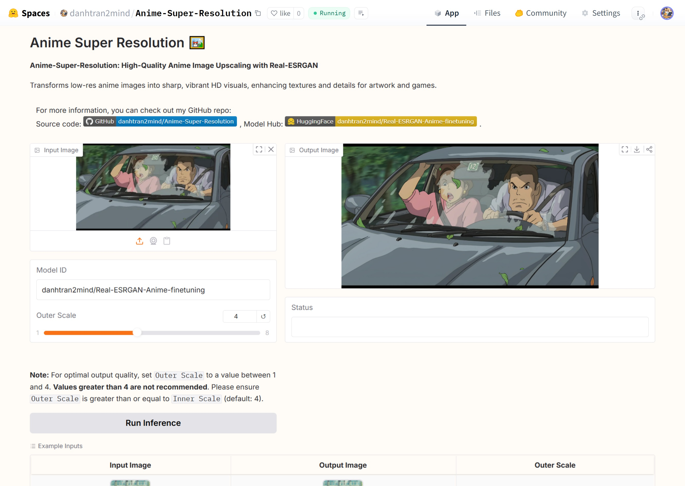

# Anime Super Resolution 🖼️

[](https://github.com/danhtran2mind/Anime-Super-Resolution/stargazers)


[](https://huggingface.co/docs/hub)
[](https://pytorch.org/)
[](https://pypi.org/project/pillow/)
[](https://numpy.org/)
[](https://pytorch.org/vision/stable/index.html)
[](https://huggingface.co/docs/diffusers)
[](https://gradio.app/)
[](https://github.com/xinntao/Real-ESRGAN)
[](https://github.com/ai-forever/Real-ESRGAN)
[](https://opensource.org/licenses/MIT)

## Introduction 🌟

Anime Super Resolution 🖼️ enhances anime-style images using a fine-tuned Real-ESRGAN model, optimized for clarity and detail. Built on the RealESRGAN_x4plus model, it leverages a private dataset of 27,052 high-resolution (1920x1080) anime frames 📸. The project offers tools for data processing, training, inference, and an interactive Gradio demo, accessible on platforms like Colab, Kaggle, and locally 🚀.

## Key Features ✨

-   **Anime-Specific Upscaling** 🎨: Fine-tuned Real-ESRGAN for high-quality anime image super-resolution.
    
-   **Large Anime Dataset** 📚: 27,052 high-res anime frames for robust training.
    
-   **Interactive Gradio Demo** 🖥️: Easy model testing via HuggingFace-hosted interface.
    
-   **Multi-Platform Support** 🌐: Runs on Colab, Kaggle, JupyterLab, and more.
    
-   **Data Processing Tools** 🛠️: Scripts for multiscale dataset creation and meta-info generation.
    
-   **Flexible Training/Inference** ⚙️: Customizable configurations for training and upscaling.
    
-   **Open-Source** 📖: MIT-licensed, built with PyTorch, NumPy, and Pillow.
    
-   **Local/Cloud Compatibility** ☁️: Supports local Gradio app and cloud-based execution.

## Notebook
This notebook provides a step-by-step guide to finetune the Real-ESRGAN model for enhancing anime-style images. It covers data preparation, model configuration, training, and evaluation, optimized for clarity and reproducibility.

[](https://colab.research.google.com/github/danhtran2mind/Anime-Super-Resolution/blob/main/notebooks/anime-super-resolution.ipynb)
[](https://studiolab.sagemaker.aws/import/github/danhtran2mind/Anime-Super-Resolution/blob/main/notebooks/anime-super-resolution.ipynb)
[](https://deepnote.com/launch?url=https://github.com/danhtran2mind/Anime-Super-Resolution/blob/main/notebooks/anime-super-resolution.ipynb)
[](https://mybinder.org/v2/gh/danhtran2mind/Anime-Super-Resolution/main?filepath=notebooks/anime-super-resolution.ipynb)
[](https://console.paperspace.com/github/danhtran2mind/Anime-Super-Resolution/blob/main/notebooks/anime-super-resolution.ipynb)
[](https://mybinder.org/v2/gh/danhtran2mind/Anime-Super-Resolution/main)
[](https://www.kaggle.com/notebooks/welcome?src=https%3A%2F%2Fgithub.com%2Fdanhtran2mind%2FAnime-Super-Resolution/blob/main/notebooks/anime-super-resolution.ipynb)
[](https://github.com/danhtran2mind/Anime-Super-Resolution/blob/main/notebooks/anime-super-resolution.ipynb)

## Dataset
### Source
The dataset is privately extracted from anime films, comprising 27,052 images with a resolution of 1920x1080. Please read at [Download Dataset](docs/scripts/download_dataset_doc.md) if you want to use this dataset.

### Data Structure
The Data Structure is
```markdown
data/ 📁
├── anime-images-raw/ 📁
│   ├── frame_0001.jpg 📸
│   ├── frame_0001_1.jpg 📷
│   └── ... 📸
├── anime-images-multiscale/ 📁
│   ├── frame_0001T0.png 📸
│   ├── frame_0001T1.png 📸
│   ├── frame_0001T2.png 📸
│   ├── frame_0001T3.png 📸
│   ├── frame_0001_10T0.png 📸
│   ├── frame_0001_10T1.png 📸
│   ├── frame_0001_10T2.png 📸
│   ├── frame_0001_10T3.png 📸
│   └── ... 📸
└── meta_info/ 📁
    └── meta_info_multiscale.txt 📄
```
To proceed with the topic, please consult the section on [Real-ESRGAN Data Processing](#real-esrgan-data-processing-for-training) for Training for comprehensive details and guidance.

## Base Model
The Real-ESRGAN-Anime-finetuning model was developed by fine-tuning the pre-trained [](https://github.com/xinntao/Real-ESRGAN/releases/download/v0.1.0/RealESRGAN_x4plus.pth) model, leveraging its robust foundation to enhance performance specifically for anime-style image super-resolution tasks.

<!-- https://github.com/xinntao/Real-ESRGAN/releases/download/v0.1.0/RealESRGAN_x4plus.pth
https://github.com/xinntao/Real-ESRGAN/releases/download/v0.2.2.3/RealESRGAN_x4plus_netD.pth -->

## Demonstration

### Interactive Demo

Explore the interactive demo hosted on HuggingFace:
[](https://huggingface.co/spaces/danhtran2mind/Anime-Super-Resolution)

Below is a screenshot of the SlimFace Demo GUI:



### Run Locally

To run the Gradio application locally at the default address `localhost:7860`, execute:

```bash
python apps/gradio_app.py
```

## Installation
### Clone GitHub Repository
```bash
git clone https://github.com/danhtran2mind/Anime-Super-Resolution
cd Anime-Super-Resolution
```
### Install Dependencies (Training + Inference)
```bash
pip install -e .
```
### Install Dependencies for Inference only
```bash
pip install -r requirements/requirements_inference.txt
```
### Execute Sripts

#### Download Model checkpoints

- Download only model checkpoint for Inference
    ```bash
    python scripts/download_ckpts.py
    ```

- For training from `Real-ESRGAN` Model checkpoint

    ```bash
    python scripts/download_ckpts.py --base_model_only
    ```
- For training from `Real-ESRGAN-Anime-finetuning` Model checkpoint
    ```bash
    python scripts/download_ckpts.py --full_ckpts
    ```
More detail you can read at [Download Model Checkpoints](docs/scripts/download_model_ckpts.md).

#### Setup Third Party
```bash
    python scripts/setup_third_party.py
```

#### Download Dataset
```bash
    python scripts/download_datasets.py \
        --dataset_id "<huggingface_dataset_id>"
        --huggingface_token "<your_huggingface_token>"
```
More detail you can read at [Download Dataset](docs/scripts/download_dataset_doc.md).

## Usage

### Real-ESRGAN Data Processing (for Training)
First you need see the data structure at [Data Structure](#data-structure). Then execute below scripts to process dataset.
- Create `multiscale` Folder
    ```bash
    python src/third_party/Real-ESRGAN/scripts/generate_multiscale_DF2K.py \
        --input ./data/anime-images-raw \
        --output ./data/anime-images-multiscale
    ```
- Create `meta_info_multiscale.txt`
    ```bash
    python src/third_party/Real-ESRGAN/scripts/generate_meta_info.py \
    --input ./data/anime-images-raw ./data/anime-images-multiscale \
    --root ./data ./data \
    --meta_info "./data/meta_info/meta_info_multiscale.txt"
    ```

### Training
#### Training Script
```bash
python src/anime_super_resolution/train.py \
    --config "<your_model_config_yml_path>" \
    --auto_resume
```

#### Additional Arguments
For more details and available options, refer to the [Training Document](docs/training/training_doc.md).

You can see [Real-ESRGAN Training](https://github.com/xinntao/Real-ESRGAN/blob/master/docs/Training.md), and 
[BasicSR Training Options](https://github.com/danhtran2mind/BasicSR/blob/master/basicsr/utils/options.py) for more details.

### Inference
#### Inference Script
<!-- ```bash
python src/anime_super_resolution/infer.py
``` -->
```bash
python src/anime_super_resolution/infer.py \
    --input_path tests/test_data/input_image.png \
    --output_dir tests/test_data \
    --suffix real_esrgan_anime \
    --outscale 2 \
    --model_path ckpts/Real-ESRGAN-Anime-finetuning/net_g_latest.pth
```

#### Inference Examples


<table border="1">
  <tr>
    <th>Example</th>
    <th>Image Type</th>
    <th>Image</th>
  </tr>
  <tr>
    <td rowspan="2" style="text-align: center;">Ex. 1</td>
    <td style="text-align: center;">Original Image</td>    
    <td style="text-align: center;">
        
    </td>
  </tr>
  <tr>
    <!-- <td style="text-align: center;"></td> -->
    <td style="text-align: center;">Upscaled Image (2x)</td>
    <td style="text-align: center;">
        
    </td>
  </tr>
  <tr>
    <td rowspan="2" style="text-align: center;">Ex. 2</td>
    <td style="text-align: center;">Original Image</td>
    <td style="text-align: center;">
        
    </td>
    </td>
  </tr>
  <tr>
    <td style="text-align: center;">Upscaled Image (4x)</td>
    <td style="text-align: center;">
        
    </td>
  </tr>
  <tr>
    <td rowspan="2" style="text-align: center;">Ex. 3</td>
    <td style="text-align: center;">Original Image</td>
    <td style="text-align: center;">
        
    </td>
    </td>
  </tr>
  <tr>
    <td style="text-align: center;">Upscaled Image (6x)</td>
    <td style="text-align: center;">
        
    </td>
  </tr>
  <tr>
    <td rowspan="2" style="text-align: left;">Ex. 4</td>
    <td style="text-align: left;">Original Image</td>
    <td style="text-align: left;">
        
    </td>
    </td>
  </tr>
  <tr>
    <td style="text-align: left;">Upscaled Image (8x)</td>
    <td style="text-align: left;">
        
    </td>
  </tr>
</table>

#### Additional Arguments
For more details and available options, refer to the [Inference Document](docs/inference/inference_doc.md).


## Environment

SlimFace requires the following environment:

- **Python**: 3.10 or higher
- **Key Libraries**: Refer to [Requirements Compatible](./requirements/requirements_compatible.txt) for compatible dependencies.

## Project Credits and Resources

- This project leverages code from:

    > The Original Real-ESRGAN by [](https://github.com/xinntao) at [](https://github.com/xinntao/Real-ESRGAN). Our own bug fixes and enhancements are available at [](https://github.com/danhtran2mind/Real-ESRGAN).

    > The Inference code by 
    [](https://github.com/ai-forever) at [](https://github.com/ai-forever/Real-ESRGAN).
    Our own bug fixes and enhancements are available at [](https://github.com/danhtran2mind/Real-ESRGAN-inference)

- You can explore more Model Hubs at:

    > HuggingFace Model Hub: [](https://huggingface.co/ai-forever/Real-ESRGAN). Real-ESRGAN Model releases: [](https://github.com/xinntao/Real-ESRGAN/releases). 
    > You also download `Real-ESRGAN-Anime-finetuning` at [](https://huggingface.co/danhtran2mind/Real-ESRGAN-Anime-finetuning)


<!-- https://github.com/ai-forever/Real-ESRGAN https://github.com/danhtran2mind/Real-ESRGAN-inference
https://huggingface.co/ai-forever/Real-ESRGAN
https://github.com/xinntao/Real-ESRGAN https://github.com/danhtran2mind/Real-ESRGAN 
https://github.com/xinntao/Real-ESRGAN/releases -->